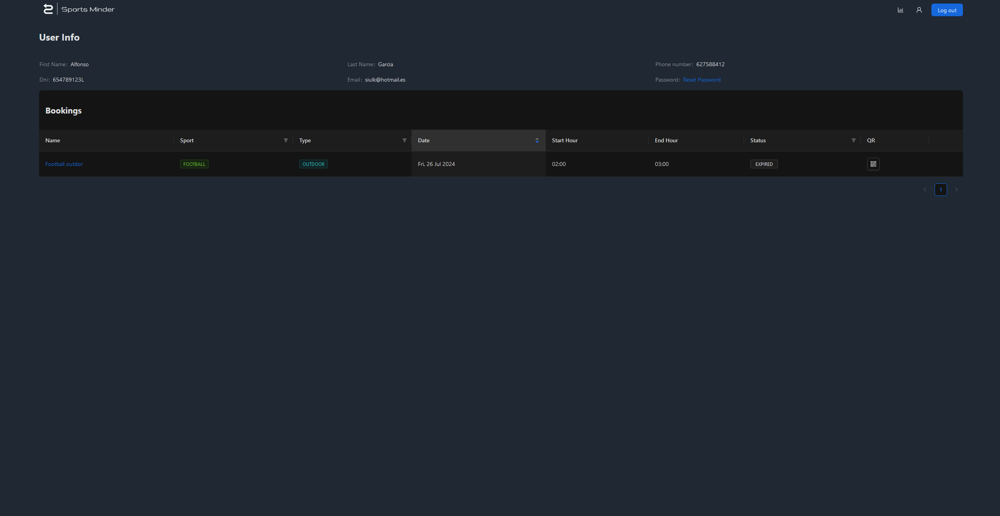
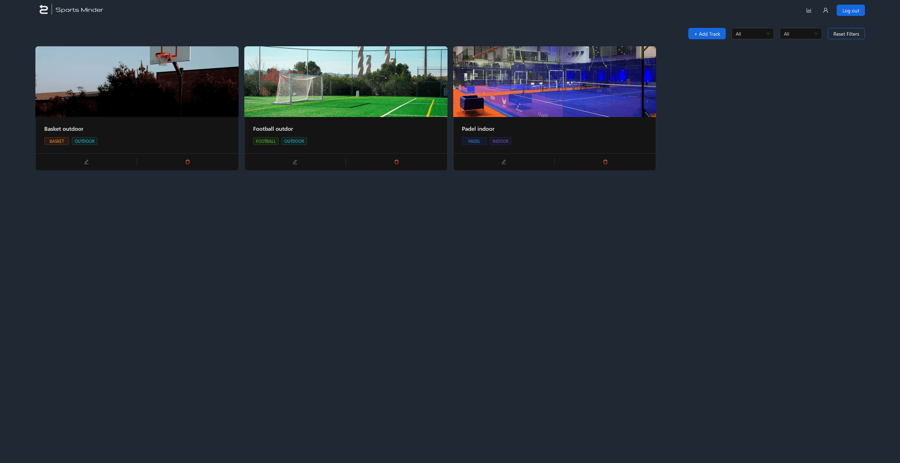
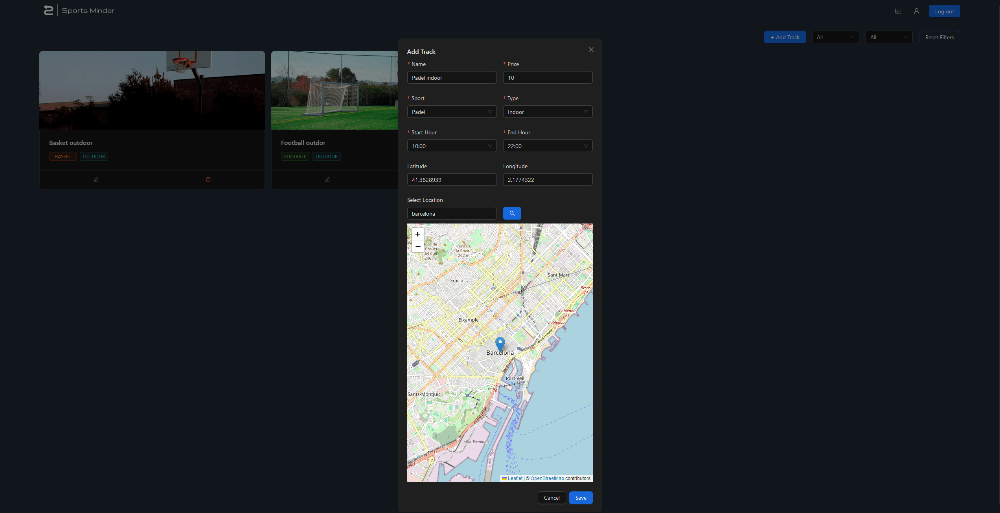
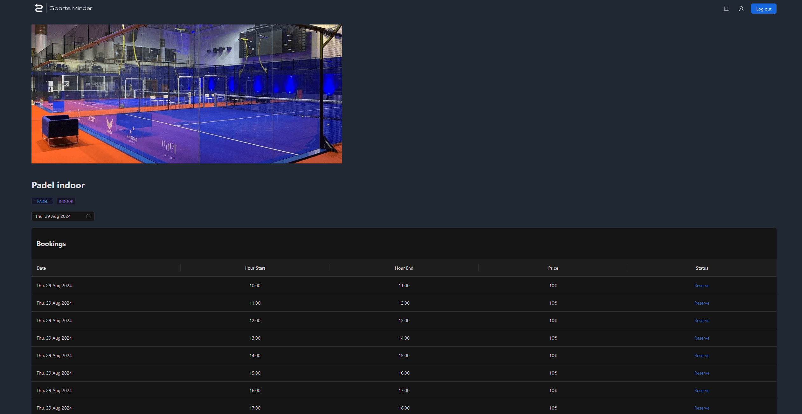
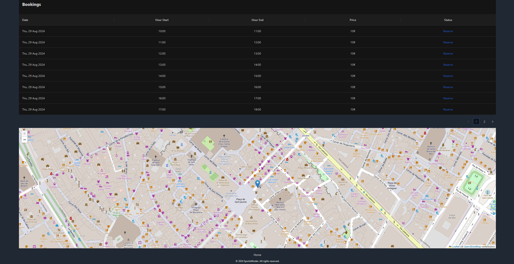
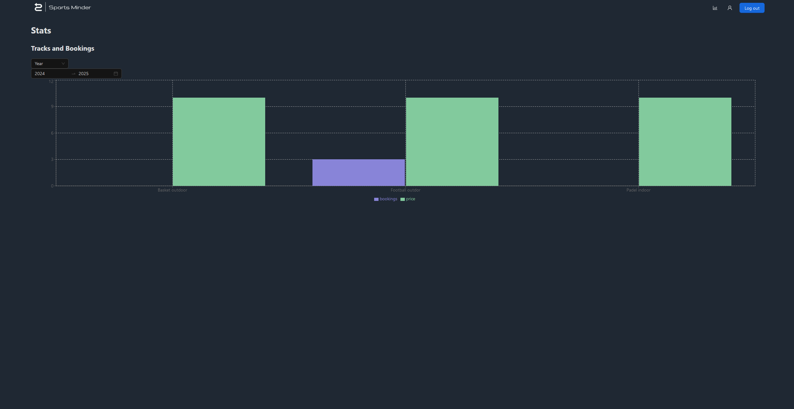

# SportsMinder Frontend

**TFG Project**

The SportsMinder frontend is built using React, offering a responsive and intuitive user interface. This document provides an overview of the key features, setup instructions, and related links.

## Table of Contents
1. [Overview](#overview)
2. [Key Features](#key-features)
    - [User Interface](#user-interface)
    - [Authentication](#authentication)
    - [Real-time Updates](#real-time-updates)
    - [Navigation](#navigation)
3. [Getting Started](#getting-started)
    - [Prerequisites](#prerequisites)
    - [Installation](#installation)
    - [Running the Application](#running-the-application)
4. [Related Repositories](#related-repositories)
5. [License](#license)

## Overview

The SportsMinder frontend is designed to be user-friendly and responsive, providing an efficient way for users to manage bookings and interact with the system.

## Key Features

### User Interface
- **Clean and Intuitive Design**: Provides an accessible and aesthetically pleasing interface for managing bookings.
- **Forms and Tables**: Features forms for creating and updating bookings, with booking information displayed in tables for easy management.



### Authentication
- **Auth0 Integration**: Manages user login, registration, and password reset processes, ensuring a secure and smooth user experience.

![Authentication]

### Real-time Updates
- **Notifications**: Implements real-time updates to keep users informed of booking confirmations, cancellations, and other critical events.

![Real-time Updates]

### Navigation
- **React Router**: Provides smooth and efficient navigation between different pages and components within the application.

![Navigation]











## Getting Started

### Prerequisites
- Node.js and npm installed on your machine.

### Installation
1. **Clone the Repository**
    ```sh
    git clone https://github.com/luislois/SportsMinder-Frontend.git
    ```
2. **Navigate to the Project Directory**
    ```sh
    cd SportsMinder-Frontend
    ```
3. **Install Dependencies**
    ```sh
    npm install
    ```

### Running the Application
1. **Start the Development Server**
    ```sh
    npm run dev
    ```
2. **View the Application**
   - Open your browser and navigate to `http://localhost:3000` to see the application in action.

## Related Repositories
- **Backend Repository**: [SportsMinder Backend](https://github.com/luislois/SportsMinder-Backend) - Handles the backend logic and API endpoints.

## License
This project is licensed under the MIT License. See the [LICENSE](LICENSE) file for details.
